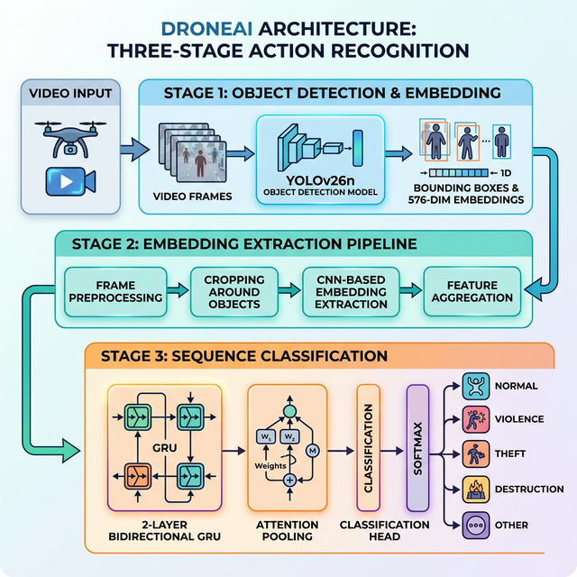

# DroneAI - Anomaly Detection System

**Drone-as-First-Responder** surveillance system that detects objects in drone footage and classifies anomalous activities using deep learning.

## Quick Start

Install [uv](https://docs.astral.sh/uv/getting-started/installation) first, then:

```bash
git clone https://github.com/clitic/droneai && cd droneai
uv sync

# Run pipeline (in order)
uv run src/train_yolo.py
uv run src/embed.py
uv run src/train_gru.py

# Launch UI
uv run src/app.py
```

See [`datasets/README.md`](datasets/README.md) for dataset download instructions.

## Architecture

DroneAI uses a three-stage pipeline. A vision model first learns to detect objects from a drone's perspective, its backbone then extracts feature embeddings from surveillance footage, and finally a temporal model analyzes those features across time to classify the type of activity occurring in the scene.



### Stage 1 — Object Detection (`train_yolo.py`)

A [YOLOv26n](https://docs.ultralytics.com/) nano model (~2.6M parameters) is fine-tuned on the [VisDrone2019-DET](https://github.com/VisDrone/VisDrone-Dataset) dataset, which contains 6,471 drone-perspective images across 10 object classes (pedestrian, car, bicycle, van, truck, etc.). This teaches the model to recognize objects commonly seen from aerial viewpoints.

The fine-tuned model serves two purposes:
- **Detection** — drawing bounding boxes around objects in the Gradio UI
- **Feature extraction** — the backbone's penultimate layer produces a 576-dimensional embedding vector per frame, encoding what objects are present and their spatial arrangement

Training uses 50 epochs at 640px with disk caching, AMP (FP16), cosine learning rate schedule, and automatic checkpoint resumption.

### Stage 2 — Embedding Extraction (`embed.py`)

This stage runs the trained YOLO backbone over every frame in the [UCF-Crime](https://www.crcv.ucf.edu/projects/real-world/) dataset (1.26M frames across 14 categories of 64×64 PNG images). For each video clip, it produces a NumPy array of shape `(T, 576)` where `T` is the number of frames and `576` is the embedding dimension.

Frames are grouped by clip name, loaded in parallel using threaded I/O, and embedded in batches of 16 for GPU efficiency. The resulting `.npy` files are saved to `datasets/ucf-crime-features/` preserving the original `Train/Test` and category directory structure.

### Stage 3 — Anomaly Classification (`train_gru.py`)

A 2-layer Bidirectional GRU with learned attention pooling classifies each video clip into one of 5 categories (grouped from 14 original UCF-Crime classes):

| Class | Original Categories |
|-------|--------------------|
| Normal | NormalVideos |
| Violence | Abuse, Arrest, Assault, Fighting |
| Theft | Burglary, Robbery, Shoplifting, Stealing |
| Destruction | Arson, Explosion, Shooting |
| Other | RoadAccidents, Vandalism |

**How it works:**

1. **Temporal encoding** — the GRU reads the embedding sequence (64 sampled frames × 576 dims) bidirectionally, capturing patterns in both forward and reverse time
2. **Attention pooling** — a learned attention layer weights which frames are most informative, then produces a single summary vector
3. **Classification head** — LayerNorm → ReLU → Linear layers map the attended representation to 5 class logits

## Use Cases

- **Law enforcement** — automated surveillance of public spaces, flagging incidents like fights, robberies, or assaults in real time for faster response
- **Traffic monitoring** — detecting road accidents from drone footage over highways and intersections, enabling quicker dispatch of emergency services
- **Event security** — scanning large crowds at concerts, rallies, or sports events for signs of violence, arson, or other threats
- **Retail loss prevention** — identifying shoplifting or stealing behavior in store surveillance feeds
- **Smart city infrastructure** — continuous monitoring of urban areas for vandalism, burglary, or suspicious activity to improve public safety
- **Disaster response** — deploying drones over affected areas to detect explosions, fires, or other hazardous situations and prioritize rescue efforts
